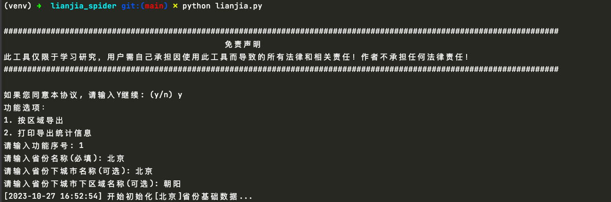
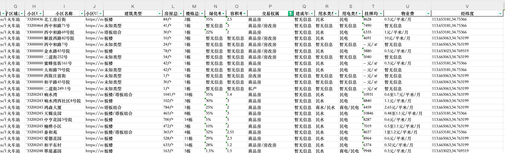
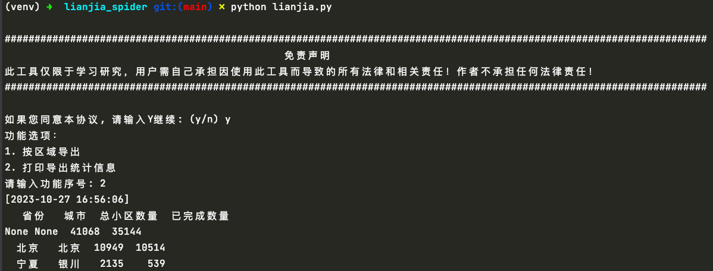

<p align="center">
    <a target="_blank" href="https://www.python.org/downloads/release/python-3810/"></a>
    <a target="_blank" href='https://github.com/fangzheng0518/lianjia_spider'></a>
    <a target="_blank" href="LICENSE"></a>
</p>

# 链家网小区信息爬取

[简介](#简介) | [特性](#特性) | [技术架构](#技术架构) | [快速开始](#快速开始) | [使用说明](#使用说明) | [免责声明](#免责声明) [附录](#附录)

# 简介

一个基于进程池的链家网快速爬虫项目，严禁将所得数据商用！

# 特性

- [x] 支持Python3.6+版本
- [x] 支持数据存储sqliteDB中
- [x] 支持导出Excel
- [x] 支持自定义区域（省、市、区）采集

# 技术架构

- Python3.6+
- request
- lxml的xpath解析
- sqlite

# 快速开始

1. clone本项目代码
2. 在项目根目录创建Python虚拟环境venv
    1. `cd lianjia_spider`
    2. `pip install virtualenv`
    3. `virtualenv venv`
3. 安装依赖库`pip install -r requirements.txt`
4. 运行`python lianjia.py`
5. 根据提示输入对应信息采集

# 使用说明

## 数据存储

- 程序运行时会使用sqlite数据库存储当前job运行历史，数据库文件`lianjia.db`

## 采集更多信息

目前程序只测试采集每个小区的楼栋数，小区数，可根据需要修改代码采集更多字段
可修改`get_community_detail`函数中`xiaoqu_info.xpath`获取的部分代码

```python
def get_community_detail(url):
    response = requests.get(url)
    if response.status_code == 200:
        final_result = []
        tree = etree.HTML(response.text)
        xiaoquInfoItems = tree.xpath('//div[@class="xiaoquInfoItem"]')
        for xiaoqu_info in xiaoquInfoItems:
            label = xiaoqu_info.xpath('.//span[@class="xiaoquInfoLabel"]/text()')[0]
            value = xiaoqu_info.xpath('.//span[@class="xiaoquInfoContent"]/text()')[0]
            final_result.append({
                "label": label,
                "value": value
            })
        return final_result
```

## 运行截图

- 运行截图
  
- 运行结果
  
- 统计信息
  


# 免责声明
请勿将`lianjia_spider`应用到任何可能会违反法律规定和道德约束的工作中，请友善使用`lianjia_spider`，遵守蜘蛛协议，不要将`lianjia_spider`用于任何非法用途。如您选择使用`lianjia_spider`即代表您遵守此协议，作者不承担任何由于您违反此协议带来任何的法律风险和损失，一切后果由您承担。

# 附录

```sql
-- 省份-城市表
CREATE TABLE IF NOT EXISTS `lj_base_province`
(
    `id`            INTEGER PRIMARY KEY AUTOINCREMENT,
    `province_name` varchar(255),
    `city_id`       varchar(255),
    `city_name`     varchar(255),
    `city_url`      varchar(255),
    `start_time`    DATETIME DEFAULT (datetime(CURRENT_TIMESTAMP, 'localtime')),
    `end_time`      DATETIME DEFAULT (datetime(CURRENT_TIMESTAMP, 'localtime')),
    `create_time`   DATETIME DEFAULT (datetime(CURRENT_TIMESTAMP, 'localtime')),
    `update_time`   DATETIME DEFAULT (datetime(CURRENT_TIMESTAMP, 'localtime'))
);

-- 城市区域表
CREATE TABLE IF NOT EXISTS `lj_base_areas`
(
    `id`              INTEGER PRIMARY KEY AUTOINCREMENT,
    `city_id`         varchar(255),
    `region_id`       varchar(255),
    `region_name`     varchar(255),
    `region_url`      varchar(255),
    `sub_region_id`   varchar(255),
    `sub_region_name` varchar(255),
    `sub_region_url`  varchar(255),
    `start_time`      DATETIME DEFAULT (datetime(CURRENT_TIMESTAMP, 'localtime')),
    `end_time`        DATETIME DEFAULT (datetime(CURRENT_TIMESTAMP, 'localtime')),
    `create_time`     DATETIME DEFAULT (datetime(CURRENT_TIMESTAMP, 'localtime')),
    `update_time`     DATETIME DEFAULT (datetime(CURRENT_TIMESTAMP, 'localtime'))
);

-- 所有小区表
CREATE TABLE IF NOT EXISTS `lj_base_xiaoqu`
(
    `id`            INTEGER PRIMARY KEY AUTOINCREMENT,
    `city_id`       varchar(255),
    `region_id`     varchar(255),
    `sub_region_id` varchar(255),
    `xiaoqu_id`     varchar(255),
    `xiaoqu_name`   varchar(255),
    `xiaoqu_url`    varchar(255),
    `create_time`   DATETIME DEFAULT (datetime(CURRENT_TIMESTAMP, 'localtime')),
    `update_time`   DATETIME DEFAULT (datetime(CURRENT_TIMESTAMP, 'localtime'))
);

-- 每个小区采集详细数据表
CREATE TABLE IF NOT EXISTS `lj_xiaoqu_detail`
(
    `id`          INTEGER PRIMARY KEY AUTOINCREMENT,
    `xiaoqu_id`   varchar(255),
    `fwzs`        varchar(255), -- 房屋总数
    `ldzs`        varchar(255), -- 楼栋总数
    `create_time` DATETIME DEFAULT (datetime(CURRENT_TIMESTAMP, 'localtime')),
    `update_time` DATETIME DEFAULT (datetime(CURRENT_TIMESTAMP, 'localtime'))
);
```